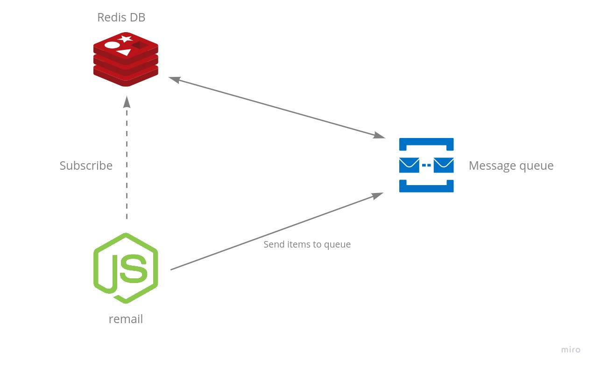

<div align="center">
  
  
</div>

<hr>

<br>

<h4 align="center">
  Aplicação de conhecimentos em Node.js e Redis para desenvolvimento de um microsserviço para envio de e-mails.
</h4>

<br>

## :gear: Arquitetura inicial



<br>

## Executando o projeto

* Versão do [Node.js](https://nodejs.org/):
```console
v14.17.1
```

* É necessário se conectar a uma instância do [Redis](https://redis.io/). Recomendo fortemente o uso do [Docker](https://www.docker.com/) para criar 
uma instância na sua própria máquina. Com o docker instalado, basta executar o seguinte comando que estará criada a sua instância do banco de dados do Redis:

```console
deusimar@deusimar:~$ docker run --name redis -p 6379:6379 redis
```

<strong>continua...</strong>
